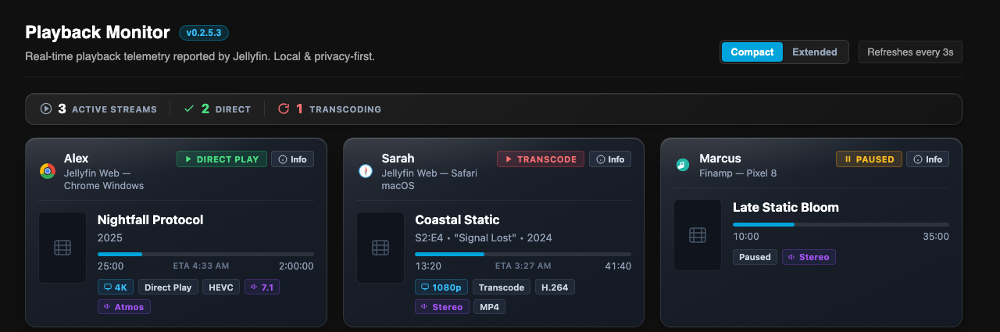

# Playback Info Card for Jellyfin

A Now Playing monitor for Jellyfin: a live grid of active streams — play state, resolution, HDR, codecs, hardware transcode engine — read straight from what Jellyfin reports, never guessed. Optional native Discord/Telegram notifications for playback events. No analytics, no external calls, no telemetry.

Latest release: **v0.2.5.4** — [changelog](https://github.com/Ubaidofficial/Playback-info-card/releases).

## Where to find it

**Dashboard → Now Playing** replaces the stock Devices widget automatically. **Dashboard → Server → Playback Monitor** is the same page as a dedicated view — admins see every session, everyone else sees only their own, decided by role, one sidebar entry for both.

## Features

- Compact/extended modes, summary strip with a real Direct vs. Transcode split.
- Full telemetry: resolution, HDR, codecs, bit depth, channels, subtitles, framerate, bitrate.
- Transcode diagnostics (hardware engine, container, reason) sourced only from what the server actually reports — never fabricated.
- ETA, Atmos/DTS:X detection, audio language, subtitle delivery method.
- ~30 brand-accurate inline client/OS logos (browsers, native apps, TVs, consoles — no CDN).

## Installation

**Catalog (recommended):** Dashboard → Plugins → Repositories → add `https://raw.githubusercontent.com/Ubaidofficial/Playback-info-card/main/manifest.json` → Catalog → install **Playback Info Card** → restart Jellyfin.

**Manual:** download the zip from the [latest release](https://github.com/Ubaidofficial/Playback-info-card/releases/latest), extract into `plugins/PlaybackCard/`, restart.

Platform paths, Docker/reverse-proxy notes, and rollback steps: [docs/ADVANCED.md](docs/ADVANCED.md).

## Notifications (Discord & Telegram)

Configure from the Playback Monitor page (**Playback Notifications**, admins only) — no external plugin needed. Usernames/device names are off by default; Discord mentions are disabled; Telegram output is HTML-escaped. Bot/webhook setup steps: [docs/ADVANCED.md](docs/ADVANCED.md).

## Privacy & security

Runs only against your own server. The diagnostics panel redacts anything sensitive before you can copy it, and Discord/Telegram secrets are encrypted at rest. Full policy and how to report a vulnerability: [SECURITY.md](SECURITY.md).

## Known limitations

Native apps report sessions into the grid but don't render this plugin's own UI (web-dashboard only). Device names are whatever the client self-reports.

## How this is built

One-person side project. I use Claude Code for a meaningful share of the implementation and review — I write the requirements and test every change against a real Jellyfin server before it ships.

## License

[MIT](LICENSE)
