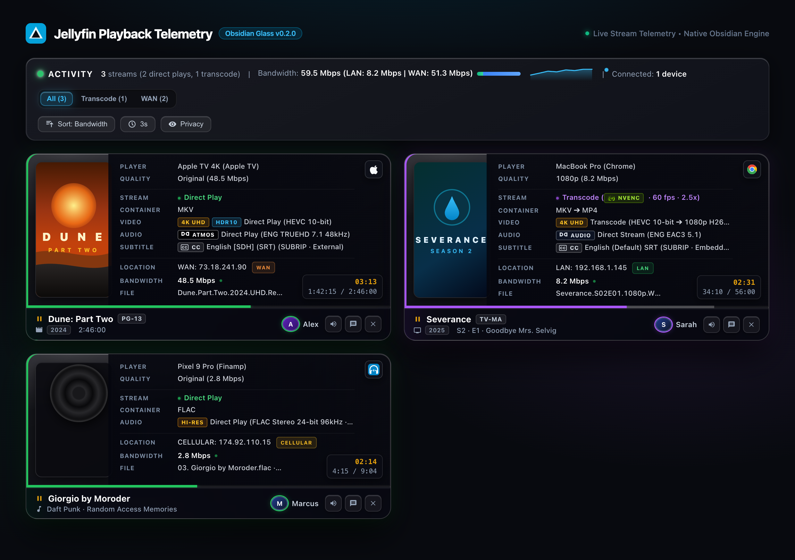
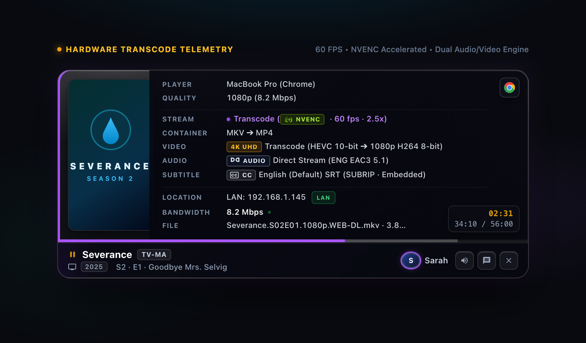
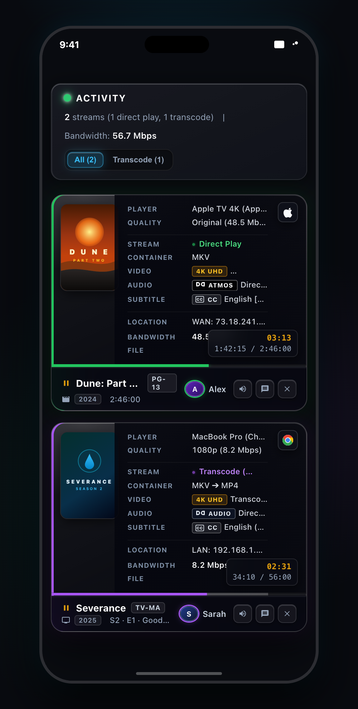

<p align="center">
  
</p>

<h1 align="center">Playback Info Card for Jellyfin</h1>

<p align="center">
  <strong>Stop guessing why your server is buffering. Mission-control stream intelligence, deep hardware telemetry, and remote admin controls &mdash; natively inside your Jellyfin dashboard.</strong>
</p>

<p align="center">
  <code>Jellyfin.Plugin.PlaybackCard</code>
</p>

<p align="center">
  <a href="https://jellyfin.org"></a>
  <a href="https://dotnet.microsoft.com/"></a>
  <a href="LICENSE"></a>
  
  
</p>

---

## Why Playback Info Card?

Ever had a family member or friend text you asking why their movie is buffering, leaving you scrambling through server logs trying to figure out what happened?

- *Is the GPU pegged?*
- *Did Jellyfin decide to transcode 4K HDR down to 1080p on the CPU because of PGS subtitles?*
- *Is the client Wi-Fi dropping packets, or is the WAN upload saturated?*

**Playback Info Card eliminates the mystery.** It transforms the standard Jellyfin Admin Dashboard into a high-performance flight deck. You get instant, plain-English hardware diagnostics, real-time transcode multipliers and FPS, granular LAN vs. WAN bandwidth tracking, and one-click remote session controls &mdash; all wrapped in an ultra-modern Liquid Glass interface.

**Zero external Docker containers. Zero database locks. Zero bloated background daemons. Just pure native speed.**

---

## Screenshots

### Studio Dashboard & Telemetry Matrix
> Multi-stream flight deck featuring 4K HDR Direct Play, Hardware NVENC Transcoding, and Lossless Hi-Res Audio with real-time bandwidth analytics.

<p align="center">
  
</p>

### Stream Hardware Telemetry Detail
> High-density diagnostic inspection showing GPU acceleration type, live transcode multiplier, frame rate, container paths, and copyable file paths.

<p align="center">
  
</p>

### Mobile-Responsive View
> Full-featured mobile layout with touch-friendly controls, responsive time stacks, and ergonomic action buttons for administration on the go.

<p align="center">
  
</p>

---

## Key Features

### 1. Logo-First High-Density Telemetry Matrix
- **Space-Efficient Two-Column Diagnostic Table**:
  - `PLAYER`: Consolidated device & client profile (e.g. `Apple TV 4K (Swiftfin)`, `MacBook Pro (Chrome)`, `Pixel 9 Pro (Finamp)`)
  - `QUALITY`: Original vs. transcoded resolution and target bitrates
  - `STREAM`: Live play method badge (`DIRECT PLAY`, `DIRECT STREAM`, `TRANSCODE`) with inline **GPU hardware acceleration badges** (`NVENC`, `QSV`, `VTB`, `AMF`, `VAAPI`)
  - `CONTAINER`: Media container transformation pipeline (e.g. `MKV ➔ MP4` or `Direct Play MKV`)
  - `VIDEO`: Codec, bit-depth, and frame rate with inline cinema badges (`4K UHD`, `Dolby Vision`, `HDR10`, `HLG`)
  - `AUDIO`: Codec, spatial channels (`5.1`, `7.1`), sample rate (`48kHz`, `96kHz`) with inline sound badges (`Dolby Atmos`, `Dolby Audio`, `DTS-HD`, `Hi-Res FLAC`)
  - `SUBTITLE`: Active subtitle track and format with inline `[CC]` Closed Caption badge and burn-in diagnostic alerts
  - `LOCATION`: Network origin with connection badge (`LAN`, `WAN`, `CELLULAR`) and client IP
  - `BANDWIDTH`: Real-time session bandwidth throughput with live pulse beacon
  - `FILE`: Click-to-copy source media path with file size and instant "Copied!" feedback
- **Hardware Acceleration Detection**: Automatic identification of NVENC, Intel QuickSync (QSV), VAAPI, Apple VideoToolbox, AMD AMF, or CPU software encoding with signature brand color pills.
- **Live Transcode Performance & FPS**: Real-time FPS metrics and transcode speed multiplier (`2.5x @ 60 FPS`) with automatic low-speed stutter alarms if speed falls below `1.0x`.

### 2. 25 Official Vector Brand Badges (100% Offline)
- Crisp, high-fidelity multi-color vector SVGs embedded directly into the interface:
  - **Browsers**: Apple Safari, Google Chrome, Mozilla Firefox, Microsoft Edge, Brave, Opera GX, Vivaldi
  - **Jellyfin Community Clients**: Streamyfin, Finamp, Findroid, Feishin, Swiftfin, Jellyfin Web
  - **TV & Ecosystems**: Apple TV, Apple iOS/macOS, Google Android, Nvidia Shield TV, Google Chromecast, Amazon Fire TV, Roku
  - **Consoles & Home Theater**: Kodi, Infuse, Sony PlayStation, Microsoft Xbox, LG webOS, Samsung Tizen
- **100% Local**: No external CDN calls, no tracking pixels, zero latency &mdash; fully operational in air-gapped homelabs.

### 3. Live Bandwidth Visualizer & Interactive Sparkline
- **Real-Time Bandwidth Sparkline**: Rolling bandwidth trendline showing server throughput over time. Hover over any point to activate the interactive hairline cursor and reveal a frosted glass tooltip detailing exact throughput, LAN vs. WAN split, and peak velocity.
- **LAN vs. WAN Segmented Counter**: Instant breakdown of internal home network traffic versus outbound WAN upload utilization.
- **Smart Multi-Stream Sorting**: Sort concurrent streams on the fly by:
  - `Default`: Server session order
  - `Bandwidth`: Highest bitrate stream first
  - `Transcodes`: Active transcoding sessions pinned to the top
  - `Progress`: Longest duration / highest percentage watched
  - `User A-Z`: Alphabetical by user account name
- **Configurable Polling Engine**: 1-click toolbar pill (`⏱ 3s`) cycling between `1s` (Real-time), `3s` (Balanced default), `5s` (Eco), and `10s` (Low-power); restarts the polling loop dynamically without reloading the page.
- **Privacy Mode (`[O] Privacy`)**: One-click toggle that masks user account names and IP addresses for stream-safe screenshots and screen shares.
- **Instant Stream Filter Pills**: Filter sessions by `All`, `Transcode`, `WAN`, or `Paused`.

### 4. Frosted Glass Time HUD Capsule
- Floating glass capsule with `backdrop-filter: blur(14px)` and specular border bevel.
- **Dual Time Mode**: Displays expected completion time (`ETA 10:45 PM`) or paused elapsed duration (`Paused 04:12`).
- **Interactive Duration Toggle**: Click to toggle between ETA and `Elapsed / Total` (`34:10 / 56:00 (61%)`).
- **Smooth 1-Second Ticker**: Smoothly advances progress bar and time counters between 3-second server polling cycles.
- **Dual-Layer Progress Bar**: Visualizes current playback position alongside the transcode buffer fill.

### 5. Remote Session Command
- **Remote Play / Pause**: Freeze or resume client playback with one click.
- **Remote Mute / Unmute**: Remotely mute or unmute client audio.
- **Direct Client Messaging**: Send pop-up alerts to users' screens before scheduled server maintenance.
- **One-Click Stream Termination**: Instantly kill bandwidth-hogging or unauthorized sessions.

### 6. Liquid Glass Obsidian Design System
- Deep obsidian base (`#080a0f`) with physical glass refraction, meniscus border bevels, and subtle specular optics.
- Zero cartoon emojis, zero generic dashboard clutter &mdash; engineered like high-end aerospace instrumentation.
- Responsive on all screen sizes &mdash; from multi-monitor ultrawide displays down to mobile phones with tactile touch-action zones.

### 7. Engineered for Performance
- **Zero Memory Leaks**: Full integration with Jellyfin Web's Single Page Application lifecycle (`viewshow`, `viewhide`, `viewdestroy`).
- **State Hashing**: Prevents redundant DOM re-renders to maintain 60 FPS smooth scrolling.
- **Zero Server Overhead**: 100% in-memory client telemetry querying standard `ApiClient.getSessions()`. Zero disk I/O, zero database locks.
- **Standalone Compatibility**: Graceful fallback guards ensuring 0 console errors when run standalone or as an installed plugin.

---

## Installation

### Prerequisites
- [Jellyfin Media Server](https://jellyfin.org/downloads/) **10.9+** or **v12+**
- [.NET 8.0 SDK](https://dotnet.microsoft.com/download/dotnet/8.0) (only for building from source)

---

### Method 1: Plugin Repository (Recommended)

Install directly from the Jellyfin Web UI with automatic updates:

1. Open your Jellyfin Web interface and navigate to **Dashboard** &#10132; **Plugins** &#10132; **Repositories**
2. Click the **+** button to add a new repository
3. Enter the following:
   - **Repository Name**: `Playback Info Card`
   - **Repository URL**:
     ```
     https://raw.githubusercontent.com/Ubaidofficial/Playback-info-card/main/manifest.json
     ```
4. Click **Save**
5. Switch to the **Catalog** tab under Plugins
6. Find **Playback Info Card**, click **Install**, and select the latest version
7. **Restart** your Jellyfin Server

The playback card will automatically appear at the top of your Admin Dashboard whenever streams are active.

---

### Method 2: Manual Installation (Release ZIP)

1. Download `Playback-info-card.zip` from the [Latest Release](https://github.com/Ubaidofficial/Playback-info-card/releases/latest)
2. Locate your Jellyfin plugins directory:
   - **Linux**: `/var/lib/jellyfin/plugins`
   - **Windows**: `%ProgramData%\Jellyfin\Server\plugins`
   - **macOS**: `~/.local/share/jellyfin/plugins`
   - **Docker**: `/config/plugins` (mapped volume)
3. Create a folder and extract:
   ```bash
   mkdir -p /var/lib/jellyfin/plugins/PlaybackCard
   unzip Playback-info-card.zip -d /var/lib/jellyfin/plugins/PlaybackCard
   ```
4. Verify the folder contains:
   - `Jellyfin.Plugin.PlaybackCard.dll`
   - `plugin.json`
5. **Restart** your Jellyfin server

---

### Method 3: Build from Source

```bash
git clone https://github.com/Ubaidofficial/Playback-info-card.git
cd Playback-info-card
dotnet build -c Release
```

Copy the compiled DLL from `bin/Release/net8.0/Jellyfin.Plugin.PlaybackCard.dll` along with `plugin.json` into your Jellyfin `plugins/PlaybackCard/` directory and restart the server.

---

## Project Structure

```
Playback-info-card/
  JellyfinPlaybackCard.csproj    .NET 8 SDK project with embedded web resources
  Plugin.cs                      Plugin entry point (IHasWebPages)
  PluginConfiguration.cs         Configuration (BasePluginConfiguration)
  manifest.json                  Jellyfin plugin catalog manifest
  plugin.json                    Plugin metadata
  Web/
    playbackcard.js              Client-side engine: CSS, DOM renderer, API poller
  screenshots/                   High-resolution README preview images
  LICENSE                        MIT License
```

---

## Compatibility

| Platform    | Status             | Notes                                                                                                   |
|-------------|--------------------|---------------------------------------------------------------------------------------------------------|
| **Jellyfin** | Fully Supported   | Native plugin via `IHasWebPages`. Tested on 10.9+ and v12.                                              |
| **Emby**     | Adaptable         | Emby shares historical roots but uses a proprietary SDK. The vanilla JS engine can be adapted as a userscript. |

---

## How It Works

The plugin registers itself as an `IHasWebPages` provider, injecting `playbackcard.js` into the Jellyfin Web admin dashboard. The script:

1. **Detects** the dashboard page via URL matching (`/dashboard.html` or SPA routes)
2. **Injects** a CSS stylesheet with all Liquid Glass design tokens
3. **Polls** `ApiClient.getSessions()` every 3 seconds (or your configured interval)
4. **Renders** session cards with full telemetry into a container above `.dashboardForm`
5. **Manages** its own lifecycle via `viewshow`/`viewhide`/`viewdestroy` events to prevent memory leaks

All telemetry is transient and in-memory. The plugin writes **zero data** to disk or databases.

---

## Contributing

Contributions are welcome. Please open an issue to discuss proposed changes before submitting a pull request.

1. Fork the repository
2. Create a feature branch (`git checkout -b feature/your-feature`)
3. Commit your changes
4. Push and open a Pull Request

---

## License

This project is licensed under the [MIT License](LICENSE).

---

<p align="center">
  Built with &hearts; for the Jellyfin community
</p>
