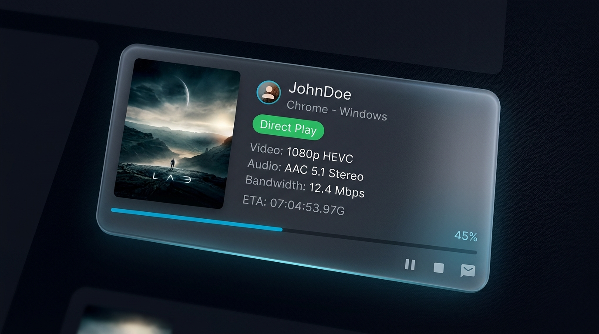
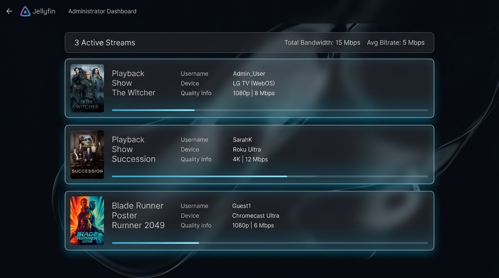
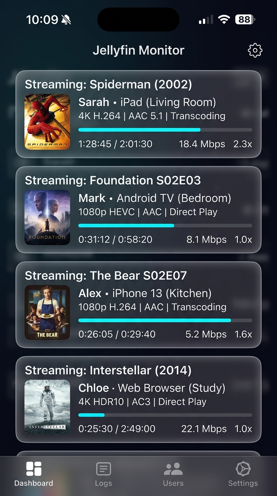

<p align="center">
  
</p>

<h1 align="center">Playback Info Card for Jellyfin</h1>

<p align="center">
  <code>Jellyfin.Plugin.PlaybackCard</code>
</p>

<p align="center">
  <a href="https://jellyfin.org"></a>
  <a href="https://dotnet.microsoft.com/"></a>
  <a href="LICENSE"></a>
  <a href="https://github.com/Ubaidofficial/Playback-info-card/releases"></a>
</p>

<p align="center">
  A native, real-time playback monitoring plugin for <strong>Jellyfin Media Server</strong> that brings Tautulli-grade session telemetry directly into the Admin Dashboard &mdash; zero external services, zero disk writes, zero dependencies.
</p>

---

## Screenshots

### Dashboard Overview
> Multiple active streams with live telemetry, bandwidth stats, and activity summary.

<p align="center">
  
</p>

### Session Card Detail
> Single session card showing poster art, stream method, codec details, progress, and action controls.

<p align="center">
  
</p>

### Mobile Responsive View
> Fully responsive layout optimized for phones and tablets with iOS-style bottom sheet interactions.

<p align="center">
  
</p>

---

## Features

### Stream Monitoring
- **Real-time polling** of `ApiClient.getSessions()` every 3 seconds with state-hash diffing to prevent unnecessary DOM repaints
- **Color-coded stream method badges**: Direct Play (green), Direct Stream (blue), Transcode (red) with throttle status
- **Stream Doctor & Plain-English Explainer**: Demystifies cryptic transcode reasons into clear diagnostics and actionable player fix recommendations
- **1-Click Fix Tip to Player**: Sends instant on-screen advice to client players with instructions on how to Direct Play
- **Container conversion paths**: Explicit transformation display (e.g., `MKV ➔ MP4`)
- **Audio and video codec breakdown**: Source and target codecs, resolutions, channels, and language tracks
- **Progress bar with ETA & Transcode Buffer**: Dynamically calculated expected completion time and transcode buffer completion percentage

### Hardware, Safety & Automated Guard
- **Smart Stream Guard (Automated Rules Engine)**:
  - **Auto-Kill Paused Streams**: Automatically closes playback sessions paused beyond configurable threshold (default: 15 min)
  - **Block 4K Software Transcodes**: Instantly stops unaccelerated 4K CPU transcodes and alerts user with educational notification
  - **Concurrent Stream Limiter**: Enforces simultaneous streams quota per user account to prevent credential sharing
  - **Recent Guard Log**: Live history of automated rule enforcements
- **Buffer Starvation & Stutter Alarm**: Proactively monitors transcode speed multiplier; flashes pulsating red warning when speed drops below 1.0x across consecutive poll cycles
- **Bottleneck Splitter ("Who is to Blame? Server vs Client Wi-Fi")**: Algorithmic root-cause diagnostic pill and inspector breakdown that objectively proves whether a stream stutter is caused by Server GPU/CPU overload, marginal encoder capacity, or Client Wi-Fi / WAN congestion
- **Tracearr-Grade Multi-IP Sharing Detection**: Real-time analysis flagging concurrent playback on multiple distinct WAN IP addresses under a single user account, with banner security alerts and card badges
- **Live Bandwidth Rolling Sparkline**: Smooth SVG micro-trendline embedded in the activity banner displaying real-time bandwidth velocity, gradient area fill, and peak/current transfer rates over a rolling window
- **HDR-to-SDR Tone Mapping Telemetry**: Explicit detection of HDR10 (PQ), HLG, and Dolby Vision wide color gamuts (BT.2020) transcoding to BT.709 SDR with VPP/OpenCL tone mapping tags
- **Hardware acceleration badges**: NVENC, QuickSync, VAAPI, VideoToolbox, AMF vs CPU Software Transcode detection
- **Transcode performance metrics**: Real-time transcode FPS and playback speed multiplier (e.g., `2.4x`)
- **Paused stream timer**: Counts elapsed pause duration to identify resource locks
- **Subtitle burn-in diagnostics**: Identifies forced transcode causes (PGS, VOBSUB bitmap subtitles)
- **Bandwidth breakdown**: Total bandwidth, LAN bandwidth, and WAN upload in the activity banner

### Admin Controls & Interactivity
- **Stream Guard Policy Manager**: Integrated configuration modal with live toggles and persistence
- **Kill stream**: Terminate any active session instantly
- **Send message**: Push a custom message directly to the client device
- **Pause / Resume**: Toggle playback state remotely
- **Privacy mode**: One-click toggle to mask IPs and usernames for screenshots or live demos
- **Stream filters**: Filter by All, Transcode, WAN, or Paused sessions

### Navigation & Media Support
- **Deep navigation links**: Click poster or title to open media details; click username for user settings
- **Audio / Music mode**: Full support for music streams with Artist, Album, Sample Rate, and codec display (FLAC, MP3, etc.)
- **Platform-specific icons**: SVG icons for Android, Safari/Apple, FireTV, Roku, and Web clients

### Liquid Glass Design System
- **Frosted glass surfaces**: `backdrop-filter: blur(16px) saturate(180%)` with obsidian dark base (`#090a10`)
- **GlassFin Specular Light Sweep**: Dynamic vertical specular gradient translation on hover (`--gf-hover-v`), inspired by KBH-Reeper's GlassFin theme
- **iOS Liquid Glass lens refraction**: Top-leading radial gradient simulating Apple GlassKit optics
- **Chromatic dispersion rims**: Cyan and magenta edge aberration for depth realism
- **GlinUI 5-level elevation architecture**: Consistent depth hierarchy across cards, chips, buttons, and modals
- **Meniscus specular highlights**: Top, left, and bottom rim bevels for physical glass appearance
- **Tactile spring physics**: `:active` press states with `scale(0.96)` to `scale(0.99)` and spring-curve easing
- **iOS bottom-sheet drag handle**: Mobile capsule indicator for sheet-style interaction on small screens

### Engineering
- **Zero memory leaks**: Hooks into Jellyfin Web's SPA lifecycle (`viewshow`, `viewhide`, `viewdestroy`)
- **State hashing**: Prevents unnecessary DOM repaints and preserves scroll position
- **Isolated DOM rendering**: Zero scroll reset, zero global state mutation
- **Self-contained**: Single JavaScript file with no external dependencies
- **Responsive**: Optimized breakpoints for desktop (1200px+), tablet (768px-1199px), and mobile (<480px)

---

## Installation

### Prerequisites
- [Jellyfin Media Server](https://jellyfin.org/downloads/) **10.9+** or **v12+**
- [.NET 8.0 SDK](https://dotnet.microsoft.com/download/dotnet/8.0) (only for building from source)

---

### Method 1: Plugin Repository (Recommended)

Install directly from the Jellyfin Web UI with automatic updates:

1. Open your Jellyfin Web interface and navigate to **Dashboard** &#10132; **Plugins** &#10132; **Repositories**
2. Click the **+** button to add a new repository
3. Enter the following:
   - **Repository Name**: `Playback Info Card`
   - **Repository URL**:
     ```
     https://raw.githubusercontent.com/Ubaidofficial/Playback-info-card/main/manifest.json
     ```
4. Click **Save**
5. Switch to the **Catalog** tab under Plugins
6. Find **Playback Info Card**, click **Install**, and select the latest version
7. **Restart** your Jellyfin Server

The playback card will automatically appear at the top of your Admin Dashboard when any streams are active.

---

### Method 2: Manual Installation (Release ZIP)

1. Download `Playback-info-card.zip` from the [Latest Release](https://github.com/Ubaidofficial/Playback-info-card/releases/latest)
2. Locate your Jellyfin plugins directory:
   - **Linux**: `/var/lib/jellyfin/plugins`
   - **Windows**: `%ProgramData%\Jellyfin\Server\plugins`
   - **macOS**: `~/.local/share/jellyfin/plugins`
   - **Docker**: `/config/plugins` (mapped volume)
3. Create a folder and extract:
   ```bash
   mkdir -p /var/lib/jellyfin/plugins/PlaybackCard
   unzip Playback-info-card.zip -d /var/lib/jellyfin/plugins/PlaybackCard
   ```
4. Verify the folder contains:
   - `Jellyfin.Plugin.PlaybackCard.dll`
   - `plugin.json`
5. **Restart** your Jellyfin server

---

### Method 3: Build from Source

```bash
git clone https://github.com/Ubaidofficial/Playback-info-card.git
cd Playback-info-card
dotnet build -c Release
```

Copy the compiled DLL from `bin/Release/net8.0/Jellyfin.Plugin.PlaybackCard.dll` along with `plugin.json` into your Jellyfin `plugins/PlaybackCard/` directory and restart the server.

---

## Project Structure

```
Playback-info-card/
  JellyfinPlaybackCard.csproj    .NET 8 SDK project with embedded web resources
  Plugin.cs                      Plugin entry point (IHasWebPages)
  PluginConfiguration.cs         Configuration (BasePluginConfiguration)
  manifest.json                  Jellyfin plugin catalog manifest
  plugin.json                    Plugin metadata
  Web/
    playbackcard.js              Client-side engine: CSS, DOM renderer, API poller
  screenshots/                   README preview images
  LICENSE                        MIT License
```

---

## Compatibility

| Platform    | Status             | Notes                                                                                                   |
|-------------|--------------------|---------------------------------------------------------------------------------------------------------|
| **Jellyfin** | Fully Supported   | Native plugin via `IHasWebPages`. Tested on 10.9+ and v12.                                              |
| **Emby**     | Adaptable         | Emby shares historical roots but uses a proprietary SDK. The vanilla JS engine can be adapted as a userscript. |
| **Plex**     | Not Supported     | Plex Web is a closed React app. Use [Tautulli](https://tautulli.com) for Plex stream monitoring.        |

---

## How It Works

The plugin registers itself as an `IHasWebPages` provider, injecting `playbackcard.js` into the Jellyfin Web admin dashboard. The script:

1. **Detects** the dashboard page via URL matching (`/dashboard.html` or SPA routes)
2. **Injects** a CSS stylesheet with all Liquid Glass design tokens
3. **Polls** `ApiClient.getSessions()` every 3 seconds
4. **Renders** session cards with full telemetry into a container above `.dashboardForm`
5. **Manages** its own lifecycle via `viewshow`/`viewhide`/`viewdestroy` events to prevent memory leaks

All data is transient. The plugin writes **zero data** to disk or databases.

---

## Contributing

Contributions are welcome. Please open an issue to discuss proposed changes before submitting a pull request.

1. Fork the repository
2. Create a feature branch (`git checkout -b feature/your-feature`)
3. Commit your changes
4. Push and open a Pull Request

---

## License

This project is licensed under the [MIT License](LICENSE).

---

<p align="center">
  Built for the Jellyfin community
</p>
