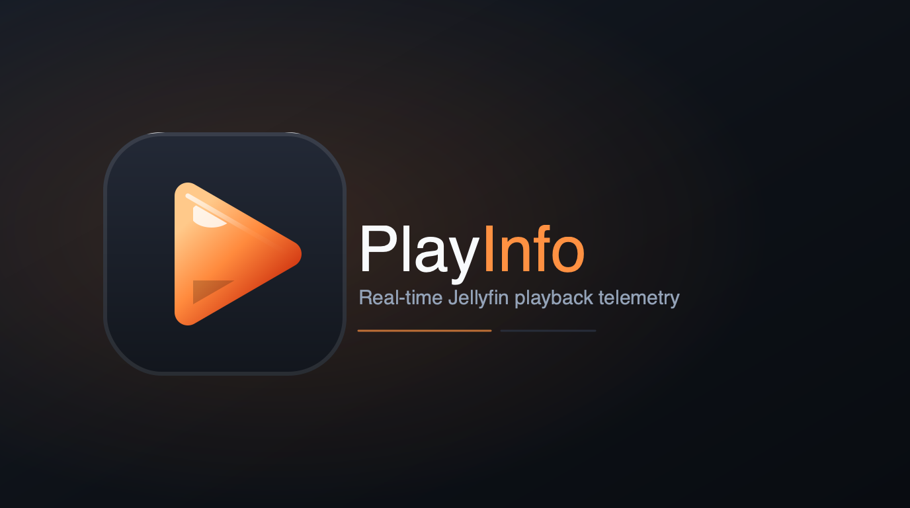
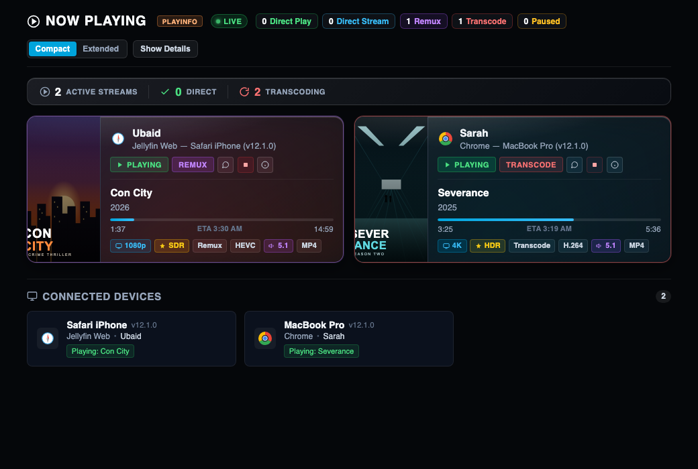
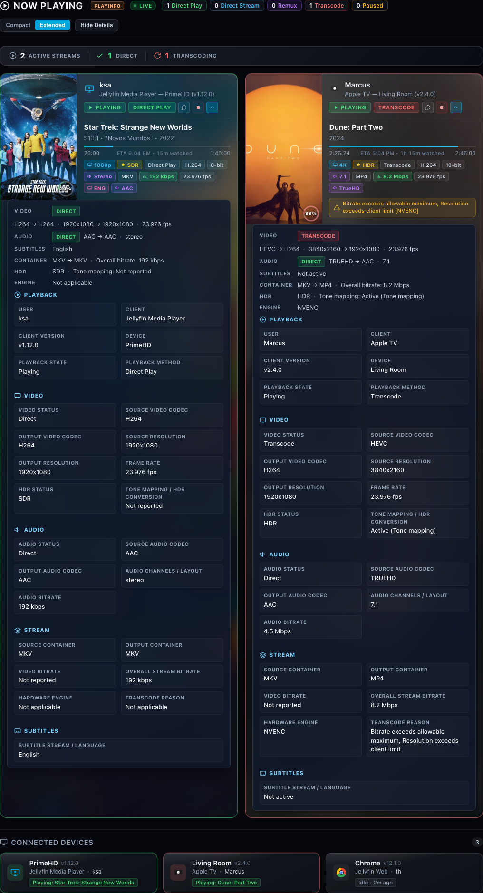

*(formerly "Playback Info Card")*

[](https://github.com/Ubaidofficial/Playback-info-card/releases/latest)
[](https://github.com/Ubaidofficial/Playback-info-card/actions/workflows/build.yml)
[](LICENSE)



A Now Playing monitor for Jellyfin. Live grid of active streams — play state, resolution, HDR, codecs, hardware transcode engine — read straight from what Jellyfin reports. Optional Discord/Telegram notifications for playback events. No analytics, no external calls, no telemetry.

## Installation

**Catalog (recommended)**
1. Dashboard → Plugins → Repositories → Add Repository
2. Repository URL: `https://raw.githubusercontent.com/Ubaidofficial/Playback-info-card/main/manifest.json`
3. Dashboard → Plugins → Catalog → install **PlayInfo**
4. Restart Jellyfin

**Manual**
1. Download the zip from the [latest release](https://github.com/Ubaidofficial/Playback-info-card/releases/latest)
2. Extract into `plugins/PlaybackCard/`
3. Restart Jellyfin

**From source**
```bash
git clone https://github.com/Ubaidofficial/Playback-info-card.git
cd Playback-info-card
dotnet build -c Release
```
Copy `bin/Release/net8.0/Jellyfin.Plugin.PlaybackCard.dll` and `plugin.json` into `plugins/PlaybackCard/`, restart Jellyfin. Same GUID and assembly name every release, so this replaces an existing install instead of duplicating it.

Docker, reverse proxies, and rollback steps: [docs/ADVANCED.md](docs/ADVANCED.md)

## Where to find it

- **Dashboard → Now Playing** — replaces the stock Devices widget automatically
- **Dashboard → Server → PlayInfo** — the same session grid as its own page. Admins see every session; everyone else sees only their own

## Features

- Compact, Extended, and Show Details view modes
- Summary strip with a real Direct vs. Transcode split
- Full telemetry in Compact mode too — resolution, HDR, codecs, bit depth, channels, subtitles, framerate, bitrate
- Completion ring on the poster, elapsed watch time next to ETA
- Transcode diagnostics (hardware engine, container, reason) straight from the server, shown as a highlighted callout
- Show Details grouped into Playback / Video / Audio / Stream / Subtitles sections — each card expands independently
- ETA, Atmos/DTS:X detection, audio language, subtitle delivery method
- ~35 brand-accurate client/OS logos, bundled locally, no CDN
- Tautulli-style cards — full-height poster art, blurred backdrop, status ring colored by playback method
- Admin controls — send a message or stop a session directly from the card via Jellyfin's own Session API (Stop always confirms first)



## Notifications (Discord & Telegram)

Configure from the PlayInfo page under Playback Notifications (admins only). Toggles and Save apply immediately.

- Usernames and device names are off by default
- Discord mentions are disabled
- Telegram output is HTML-escaped

Bot/webhook setup steps: [docs/ADVANCED.md](docs/ADVANCED.md)

## Privacy & security

- Runs only against your own server
- Diagnostics panel redacts anything sensitive before you can copy it
- Discord/Telegram secrets are encrypted at rest
- Every push and release build runs through [CodeQL](https://github.com/Ubaidofficial/Playback-info-card/security/code-scanning) and a ClamAV scan — see the [build workflow](.github/workflows/build.yml)
- Every release ships `SHA256SUMS.txt`/`MD5SUMS.txt` so you can verify the download yourself

Full policy and how to report a vulnerability: [SECURITY.md](SECURITY.md)

## Known limitations

- Native apps show up in the session grid but don't render this plugin's own UI — web dashboard only
- Device names are whatever the client reports

## How this is built

One-person project. I use Claude Code for a chunk of the implementation, but I write the requirements, review the changes, and test against a real Jellyfin server before anything ships.

## License

[GNU General Public License v3.0](LICENSE)
